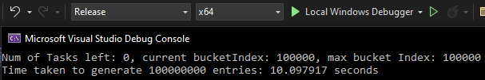

# Modulus Meme Generator
 A file generator for the hardcoded "is a number odd or even" meme
## Python
 - First attempt at the generator
 - Has more tweakable settings (pointless)
 - Didn't compile into an exe so it's slower than it could have been

## C++
 - Have more experience in C++
 - Have a threadpool library I know how to use
 - wrote to not have any tweakable settings

 100 Million Entry Stats
  
 Generated File: 

   
  
 Time taken: 

  

